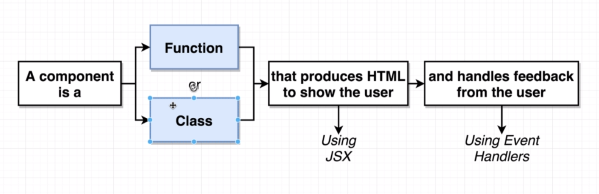
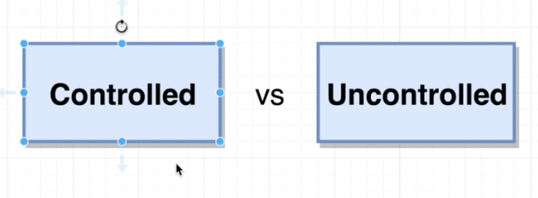
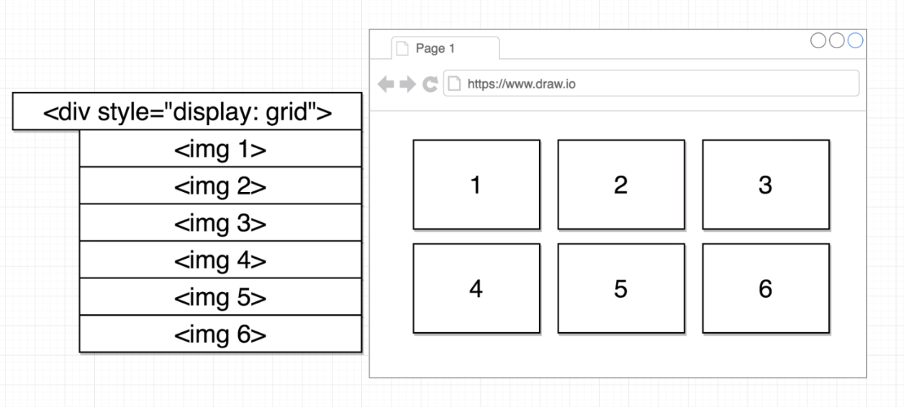

# React-JS
React Starter

Past code into link below:
https://codepen.io/sgrider/pen/yRWZEq

Dependencies:
Add React and ReactDOM libraries

Settings -> JavaScript Tab -> Under 'Add External Scripts/Pens' -> Search for 'React' and add the two libraries accordingly.

-------------------------------------
- React defines components and make them work together
- ReactDOM takes a component and render it in the DOM (HTML)

-------------------------------------
Install/Update NodeJS -> Install create-react-app -> Generate project -> Build project

1. cmd -> node -v
   
   if output == vXX.X.X, else nodejs.org/en/download -> install accordingly

2. npm install -g create-react-app

   dir -> mkdir <name> -> cd <dir-name>
   
   create-react-app <project-name>

   -g (global package install -> enable prg to be run on terminal)

   Alternate cmd: npx create-react-app <project-name>   (N.A for < npm v5.2)
  
3. React project behind the scenes lib : Webpack, Babel*, Dev server

   - ES5 -support all browser
   - ES2015 -almost all
   - ES2016-19 - poor support

   Babel(es201X[jsFile, jsFile]) -> returns es5J[jsFile, jsFile] -> load properly on almost any browser
   
   
4. Open the project in any editor (eg: atom/sublime/VS editor)

   project dir
   -----------
   folders
   - src -> written src code
   - public -> static files eg. imgs or static html
   - node_modules -> installed project dependencies
   - packages.json -> records proj dependencies and configurations
   -package-lock.json -> records exact version of installed packages
   - README.md -> how to use project instructions
   
5. Terminal -> cd <project dir/proj>
   - Start app: npm start
   - Stop app: Ctrl + c
   - localhost:3000
   
  -----------
Diff between 'import' and 'require' statement

Module system - set of rules on how code can be shared between js files

- ES2015 modules - > 'import'
- CommonJS modules - > 'require'

-----------

A component IS a 
 - Function or Class 
	- produce and show HTML TO user (JSX) 
	- handle feedback FROM user (Event handlers)

-----------
App-1

-----------
semantic ui cdn:
- https://semantic-ui.com/
- https://cdnjs.com/libraries/semantic-ui

add in head tag:
- https://cdnjs.cloudflare.com/ajax/libs/semantic-ui/2.4.1/semantic.min.css

https://github.com/marak/Faker.js/
npm install --save faker

-----------

-----------
App-2

-----------
App-3

                                                                      
